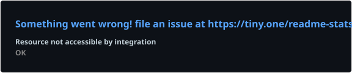

<div align="center">


<br>

<a href="https://github.com/smartadmins">

</a>

<br>

[](https://github.com/smartadmins)
[](https://smartadmins.in)

</div>

---

## 🛠️ Technology Stack

<div align="center">

### ☁️ Cloud


### ☸️ Containers & Kubernetes


### 🔄 DevOps & CI/CD


### 🐧 Systems & Automation


</div>

---

## 🚀 Featured Projects

<table>
<tr>

<td width="50%">

### ☁️ Zepto Quick Commerce

**GCP + Kubernetes + CI/CD**

* Google Kubernetes Engine
* Artifact Registry
* Docker
* GitHub Actions
* Workload Identity Federation
* Kubernetes deployments
* CI/CD automation

<a href="https://github.com/smartadmins/zepto-quick-commerce">

</a>

</td>

<td width="50%">

### 🐳 Docker & Kubernetes

**Container Platform Engineering**

* Docker
* Kubernetes
* Ingress
* Persistent Volumes
* MetalLB
* MySQL
* Container networking
* Security

</td>

</tr>

<tr>

<td width="50%">

### 🔄 CI/CD Platform

**Automation & GitOps**

* GitHub Actions
* Jenkins
* ArgoCD
* GitOps
* Trivy
* Automated builds
* Container deployment

</td>

<td width="50%">

### 🏗️ Infrastructure as Code

**Terraform + Cloud**

* AWS
* GCP
* Infrastructure as Code
* Kubernetes infrastructure
* Networking
* IAM
* Automation

</td>

</tr>
</table>

---

## 📊 GitHub Analytics

<div align="center">




<br><br>


</div>

---

## 🔥 Current Focus

<div align="center">

```text
☁️ Cloud Infrastructure
☸️ Kubernetes
🏗️ Terraform / IaC
🔄 CI/CD
🚀 GitOps / ArgoCD
🔐 Cloud & Container Security
📊 Observability
🐳 Container Platforms
```

</div>

---

## 🐍 Contribution Activity

<div align="center">

<picture>
  <source media="(prefers-color-scheme: dark)" srcset="./dist/github-snake-dark.svg">
  <source media="(prefers-color-scheme: light)" srcset="./dist/github-snake.svg">
  
</picture>

</div>

---

## 🎓 Certifications

<div align="center">

| Certification | Area            |
| ------------- | --------------- |
| 🔴 RHCE       | Linux / Red Hat |
| 🔵 CCNA       | Networking      |
| 🟣 VMware     | Virtualization  |
| 🟢 MCP        | Microsoft       |

</div>

---

## 💼 Professional Strengths

<div align="center">

**Infrastructure Management** • **Cloud Engineering** • **DevOps**
**Kubernetes** • **Automation** • **Networking** • **Security**
**Leadership** • **Communication** • **Problem Solving**

</div>

---

## 🌐 Connect

<div align="center">

<a href="https://github.com/smartadmins">

</a>

<a href="https://smartadmins.in">

</a>

</div>

---

<div align="center">

### ⚡ Infrastructure → Automation → Cloud → DevOps

**Build • Automate • Secure • Monitor • Improve**

</div>
